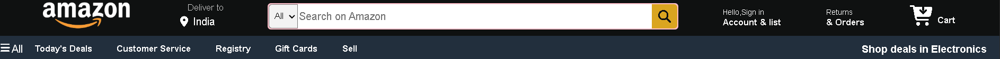
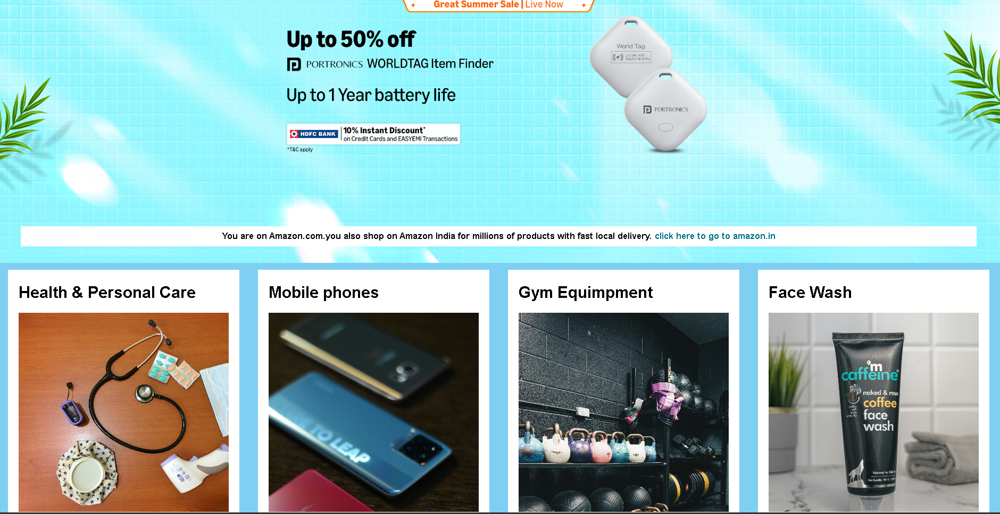
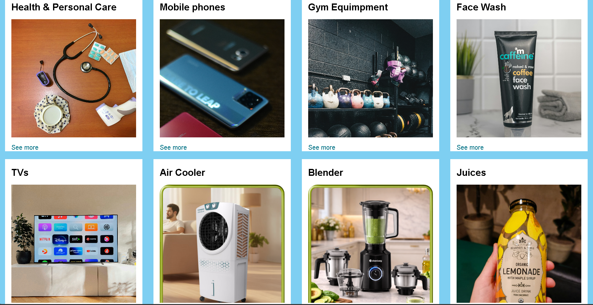
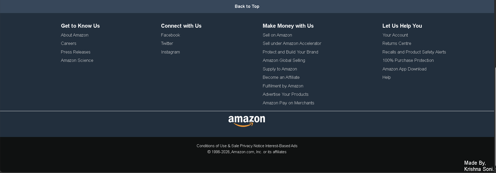

## 🔗 Live Demo

[Click Here to View Project]()
# Amazon Clone Website

A responsive Amazon homepage clone built using HTML and CSS.  
This project recreates the UI of Amazon including the navbar, hero section, shopping sections, and footer.  
The project is fully responsive and designed for practicing frontend web development skills.

---

# 📸 Screenshots

## Navbar



---

## Main Section 1



---

## Main Section 2



---

## Footer



---

# 🚀 Features

- Responsive Amazon homepage UI
- Navigation bar with search box
- Hero section banner
- Product category cards
- Footer section
- Clean layout using Flexbox

---

# 🛠️ Tech Stack

Frontend:
- HTML5
- CSS3

---

# 📂 Project Structure

```bash
Amazon-Clone/
│
├── index.html
├── style.css
├── images/
│   ├── navbar.png
│   ├── main-section1.png
│   ├── main-section2.png
│   ├── footer.png
│   ├── tv.jpg
│   ├── gym.jpg
│   └── ...
```

---

# ⚙️ Installation & Usage

1. Download or clone the repository

```bash
git clone https://github.com/krishnasoni260207/amazon-clone.git
```

2. Open `index.html` in your browser

---

# 👨‍💻 Author

Krishna Soni
